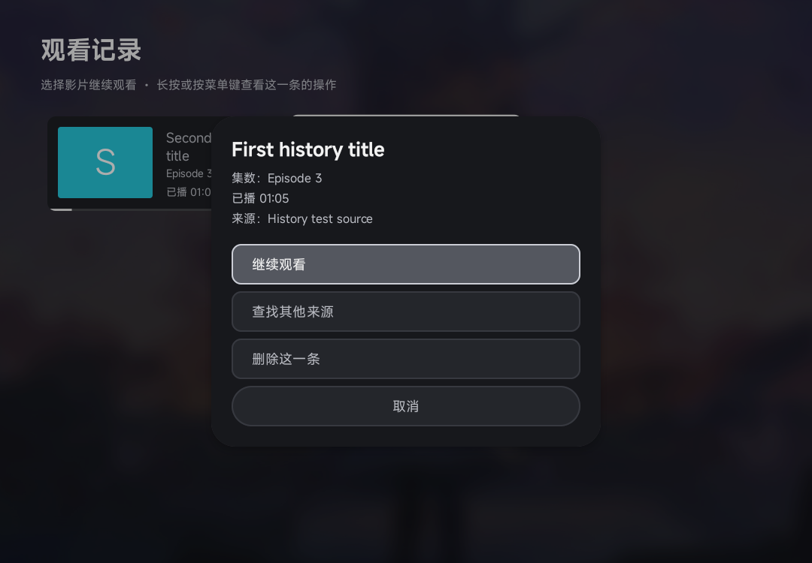
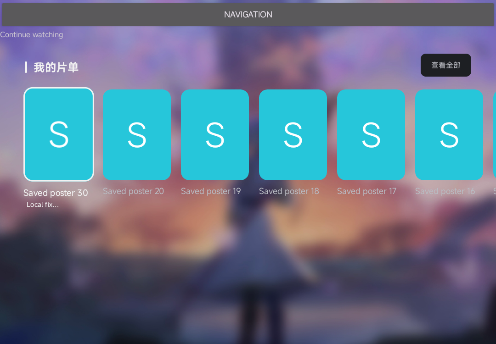
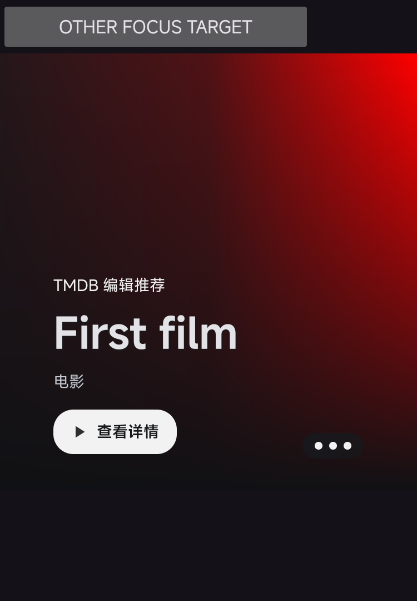

# 原生首页易用性验收

**完整 CI、本地 8 项片单状态单测及 38 项 Android 集成测试全部通过；Android 测试 0 失败、0 跳过。**

本轮增加可关闭的继续观看卡片菜单、海报首页“我的片单”，以及主视觉“原有轮播／聚焦暂停／手动切换”。菜单和片单默认关闭，主视觉默认保留原有轮播；恢复原有浏览体验会恢复这些默认值，不删除历史或收藏。界面采用 Android 原生控件，支持遥控器和触摸。

操作入口与恢复方式见 [使用说明](../../../native-discovery.md)，外部项目依据及取舍见 [原生 TV 交互研究](../../../research/2026-10-08-native-usability.md)。

## 构建与本地测试

- 应用与测试源码：`6d1b70b67e5b351d2918dc635f61f9c4341d0e1e`，对应 [PR #69](https://github.com/wobuhui666/TV/pull/69) 的最终验证版本。
- [完整 CI：37844303329](https://github.com/wobuhui666/TV/actions/runs/37844303329) 的 `headSha` 与上述提交一致，`preview` 与 `sourceprobe` 两个任务均成功。
- 两套 TV ARM64 应用及 instrumentation APK 均构建成功，包名检查与产物收集通过。
- `sourceprobe` 完成共享网络测试、手机版设置编译、Python／JavaScript 片源 API 兼容，以及工作流中的同步／一起看相关检查。`preview` 只构建对应 APK，公共回归未重复执行。
- 本地 `PosterKeepShelfStateTest` 共 **8 项通过**，日志为 `OK (8 tests)`；验证片单状态策略，Android 控件和存储行为由下列集成测试覆盖。

CI 产物元数据中的 `instrumentationExecuted: false` 表示 CI 负责构建测试包；38 项 Android 执行结果来自随后安装该产物的测试环境。

## 环境与 APK 核验

环境为 **redroid，Android 13／API 33，ARM64（`arm64-v8a`）**。系统报出型号 `SM-F900F`，但 `ro.hardware=redroid`；本轮是在实际运行的 Android 环境中验证，不构成实体三星硬件验收。

使用独立的 `com.fongmi.android.tv.preview` 与 `com.fongmi.android.tv.preview.test`。应用和测试包均取自上述成功 CI；重签名保留并核对全部非签名 ZIP 条目，应用为 1,844 项、测试为 19 项，两包使用相同预览证书。安装记录的源码提交及 SHA-256 与已核验产物一致：

```text
app  d851a86eeed243f134d0aac5024596c5cfc5a16439c9c5ad0f9cfdcd2ecb402b
test a3aa3750d3d7ee082a3ee356a477bbd542ad7571d0e4b75dc4a0ab8c5d431435
```

机器可读的构建、安装、逐套结果及截图校验和见 [验证摘要](verification.json)。

## Android 集成测试

六套测试记录的 `sourceCommit` 均为上述最终提交。逐套核对完整 `OK (N tests)`、成功状态数量和退出结果，无失败、崩溃或跳过状态；共 **38 项通过**，包括本轮新增交互 22 项及原浏览／选源回归 16 项。

| 测试类 | 通过数量 | 完整结果 |
| --- | ---: | --- |
| `HistoryActionsIntegrationTest` | 9 | `OK (9 tests)` |
| `DiscoverHeroRotationTest` | 6 | `OK (6 tests)` |
| `PosterKeepShelfIntegrationTest` | 7 | `OK (7 tests)` |
| `NativeBrowseIntegrationTest` | 8 | `OK (8 tests)` |
| `PosterSourcePriorityIntegrationTest` | 3 | `OK (3 tests)` |
| `PosterSourceSearchIntegrationTest` | 5 | `OK (5 tests)` |

历史菜单测试严格等待真实窗口获得焦点后再执行操作；最终 CI 产物已完整重跑全部六套。

| 验证范围 | 已通过的实际检查 |
| --- | --- |
| 继续观看菜单 | 首页与历史页菜单、关闭开关恢复原交互、真实长按确认／菜单键的松键保护、取消后恢复卡片焦点。 |
| 记录与配置隔离 | 单条删除保留其他记录；切配置使旧菜单失效；已接受的删除保留原配置标识；过期删除不误清共享轨道；删空后仍可导航。 |
| 查找其他来源 | 按当前影片名称打开现有搜索，保留历史进度与轨道记录。 |
| 我的片单 | 实际 Room 数据区分当前配置点播收藏和全局发现收藏；按配置范围查询且最多返回 21 条、现有页面分流及查看全部入口。 |
| 片单异步与焦点 | 取消／迟到查询不串配置；关闭或暂停不删除收藏；读取失败保留卡片，重试不抢焦点；删除最后一项收起行并恢复焦点。 |
| 主视觉轮播 | 聚焦暂停、手动模式和原有模式；窗口焦点变化；重复绑定／附着时只保留一个计时器；离开后取消旧请求。 |
| 确认目标一致 | 连续快速操作及图片延迟／失败时，可见片名与打开的影片一致。 |
| 原浏览与来源回归 | 实际恢复默认／返回首页路径、首次触摸、遥控器详情跳转、离线入口、海报和来源列表裁剪、优先级编辑与配置隔离、真实本地 HTTP 的查询排序及取消。 |

## Android 界面截图

以下图片来自受控 fixture 的实际原生界面，影片名称、来源与收藏均使用合成测试数据。

### 继续观看卡片菜单

历史页打开单条记录菜单，展示集数、进度与来源；焦点默认位于“继续观看”。



### 我的片单组件

原生片单行展示合成收藏、当前卡片焦点和“查看全部”。上方 `NAVIGATION` 与 `Continue watching` 为测试承载页的占位控件；此图展示片单组件，不作为完整首页截图。



### 主视觉聚焦暂停组件

`CorePlaybackActivity` 隔离承载的主视觉组件测试，保留竖向截图及 `OTHER FOCUS TARGET` 测试按钮。它展示组件布局，不是完整 TV 首页；聚焦暂停与恢复行为由上面的计时用例核验。



## 验证范围

本轮使用独立预览包、本地数据库 fixture、合成海报及受控 HTTP 请求，验证原生界面、配置隔离和集成行为。手机版范围为编译及共享逻辑检查，未验收手机版界面；实体三星或其他电视硬件、所有第三方片源播放、公网 TMDB 链路也不在本轮结论内。
