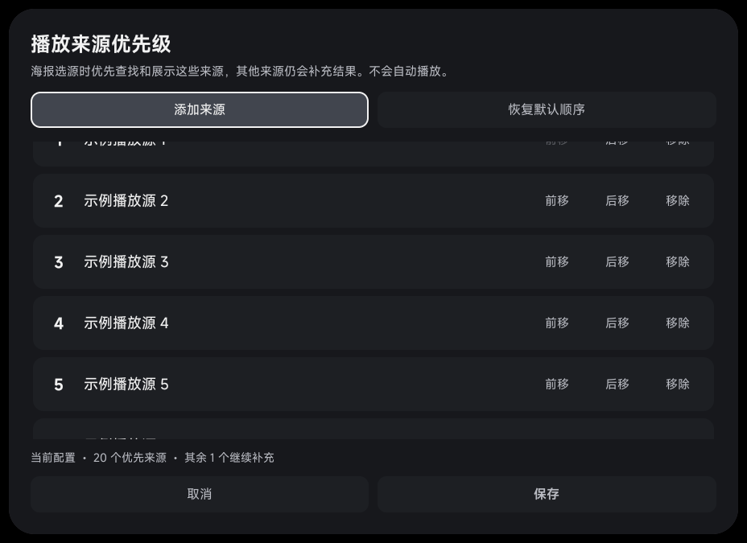

# 海报播放来源优先级验收

本轮验证首页／推荐海报详情内的播放来源优先级：按当前配置保存多个常用来源，优先查询和展示，保留其他可搜索来源作为补充；作品匹配规则、手动点选播放与恢复原有顺序的行为继续保留。操作入口及示例见 [使用说明](../../../native-discovery.md#指定常用播放来源的优先级)。

**CI、本地 68 项单测与 16 项 ARM64 redroid Android 集成测试全部通过；集成测试 0 失败、0 跳过。**

**验证环境勘误（2026-10-08）：**此前仅按系统报出的 `ro.product.model=SM_F900F` 将该端点标为“三星真机”。对同一 ADB 端点补查发现 `ro.hardware=redroid`，网络接口为容器 veth，故更正环境归类。下列测试数量、Android 实际运行结果及 APK SHA-256 校验记录保持不变；它们不构成实体三星硬件验收。

## 构建与单元测试

- 应用与测试源码：`a51b06ef5ca3fe94ecc5b3d377d8b0b93f2774c6`。
- [完整 CI：37804183714](https://github.com/wobuhui666/TV/actions/runs/37804183714)，`sourceprobe` 与 `preview` 两个任务均成功，CI 的 `headSha` 与上述提交一致。
- 两套独立包的 TV ARM64 应用及 instrumentation APK 均构建成功，并完成包名检查与产物收集。
- `sourceprobe` 任务通过手机版 Java 编译、共享网络单测、Python／JavaScript 片源 API 兼容测试，以及工作流列出的同步、一起看、OTA、缓存、诊断、预加载、搜索、发现页、来源健康度等回归。`preview` 任务只承担对应 APK 构建，公共回归未重复执行。

本地 JVM 单测共 **68 项通过**：

| 测试类 | 数量 | 覆盖范围 |
| --- | ---: | --- |
| `SearchRelevanceTest` | 13 | 片名、明确别名、年份／季数冲突、预告与相关视频边界 |
| `PosterSourceResultsTest` | 31 | 显式来源顺序、智能排序、跨来源同 ID、120 项容量、晚到优先来源、过滤不被优先级绕过 |
| `PosterSourcePrioritySettingTest` | 14 | 配置隔离、保存／清除、缺失或禁用来源、损坏数据回退、存储容量上限 |
| `DiscoverSourceSearchTest` | 5 | 优先来源的片名／别名调度、去重、未指定时的原有顺序、补充来源保留 |
| `BoundedSearchBatchTest` | 5 | 共享实际并发上限、取消旧批次与后续任务执行 |

本地测试验证策略和调度逻辑；Android 偏好存储、真实控件和设备输入另由下列集成测试覆盖。

## Android 集成验证

目标环境：redroid，Android API 33，ARM64；系统报出的型号为 `SM_F900F`。使用独立的 `com.fongmi.android.tv.preview` 及其测试包，不覆盖正式应用。

验证包固定取自上述成功 CI 提交。重签名流程保留并逐项校验所有非签名 ZIP 条目的路径与内容，核对应用／测试目标包和源码提交；安装后再次读取设备上实际 APK 的 SHA-256，两者均与已核验产物一致：

```text
app  72360b56b687a383aa51c621ea2805835d802d15d5bfdc56ccf7b065b76e5525
test e5d5a05d3b6dfa1c758c032f8267835545a4d17d07b4da9cce8fd14d61820818
```

| 测试类 | 通过数量 | 状态 |
| --- | ---: | --- |
| `NativeBrowseIntegrationTest` | 8 | `OK (8 tests)` |
| `PosterSourcePriorityIntegrationTest` | 3 | `OK (3 tests)` |
| `PosterSourceSearchIntegrationTest` | 5 | `OK (5 tests)` |

已检查以下行为：

| 验证范围 | 实际测试方法 |
| --- | --- |
| 原有首页与海报墙 | 真实恢复／重建路径，遥控器导航、详情跳转、返回焦点、首次触摸与离线入口 |
| 海报选源入口 | 从实际侧栏打开编辑器；保存后启动新一轮查询并回到优先级按钮；恢复原有浏览体验清除当前配置的优先级 |
| 晚到的优先来源 | 保留匹配与补充来源；明确片名、电影年份和类型冲突仍过滤；遥控器停在结果上时保持卡片位置，离开结果区后应用新顺序 |
| 原生编辑器 | 实际勾选、触摸与 DPAD 确认；前移／后移保持焦点；取消不保存，保存才生效；恢复默认仍先编辑草稿 |
| 配置隔离与移除 | 移除优先级不删除或禁用片源；编辑期间切换配置，旧编辑器不能写入新配置 |
| 长列表 | 20 个优先来源、部分行滚动与可见区域裁剪；头部按钮和保存／取消保持可见、可操作 |
| HTTP 调度与补充 | 设备本地真实 HTTP 服务阻塞首批六个请求，核对优先来源的原名查询先于补充来源；解除阻塞后其余查询仍执行且不重复 |
| 取消与旧轮回调 | 取消优先查询后排队的补充请求不再发出，迟到回调不污染下一轮；下一轮可重新取得实际任务槽位 |

2026-10-08 16:30 UTC 执行：HTTP 调度 3.93 秒，编辑器 6.38 秒，原生浏览 12.86 秒。逐类核对 instrumentation 的完整 `OK (N tests)` 结论与状态码，无失败、跳过或假设跳过。测试后另核对 5 个浏览相关偏好，均与测试前一致。

## 验证范围与限制

来源测试使用设备本地 HTTP 服务和示例配置；界面测试使用本地海报及可控的失败请求，相关配置和偏好在清理阶段恢复。它们验证查询、排序、隔离、取消与界面操作，不代表所有第三方片源均能播放。

本轮手机版范围为编译与共享逻辑回归，尚未验收手机版 UI；Android 集成结论仅适用于所列 redroid 测试环境，不代表实体三星设备或其他电视硬件已通过验收。本轮未重新验证公网 TMDB 链路；此前同一测试环境中的 TMDB 结果见 [原生发现页验收](../2026-10-07-native-discovery/README.md)。

## Android 运行截图

redroid Android 环境中的原生优先级编辑器，使用 20 个示例播放源与 1 个补充来源。截图刻意停在半行滚动位置：列表上下边缘裁剪内容，固定按钮保持完整，遥控器焦点停在“添加来源”。图中仅含测试数据，宿主使用纯色背景；未因环境勘误改动原图。


