# TV UI 视觉修复交付候选 R2H

2026-10-03。本轮针对用户指出的详情圆角/对齐、首页导航、搜索重叠与卡片裁切、设置粗白焦点继续修复，并处理复查发现的文件双重焦点、播放器抽屉缺少标题、全屏返回焦点错误和发现页失败后空白。代码与 ARM64 debug APK 已准备；**这是可复核的交付候选，不是全页面、全状态或真机验收全部通过的声明**。PR 保留草稿。

## 实现

- 在现有 Leanback/View/Compose 架构中加入 AndroidX TV Material 1.0.0，共用电视按钮、Surface 与深色细边焦点；保留列表导航及播放器所有权。
- 统一详情视频裁剪与描边圆角、左右高度、选集对齐；标题限定两行。退出全屏按入口恢复观看按钮或视频窗口焦点。
- 统一导航中心线、卡片缩放与安全间距；搜索建议区限制在自己的视口内，避免覆盖来源和结果。历史图片使用横向槽。
- 设置主操作和辅助按钮分开导航，主题勾预留固定空间，七个主题按钮宽度稳定；文件列表移除图标二次焦点圈。
- 播放设置抽屉同时显示操作名称与当前值；末项可达。发现页以真实内容判断空态，失败后移除加载占位，确认键可重试，旧请求回调受 generation/query 检查。

## 构建与身份

Codespace 执行以下任务成功（R2H，2 分 18 秒）：

```sh
./gradlew :app:assembleLeanbackArm64_v8aDebug \
  :app:testLeanbackArm64_v8aDebugUnitTest \
  :app:lintLeanbackArm64_v8aDebug \
  --no-daemon --build-cache --max-workers=2 --console=plain
```

216 项单测通过，无失败、错误或跳过。Lint 无错误，311 个 warning、6 个 hint；这替代旧报告的 269 warning 数字，不代表无警告。未关闭 lint 或增加 baseline。122 个源码文件与云端构建清单逐一匹配。源码清单不含交付文档/截图。

- ARM64 debug APK SHA-256：`ea254083ad14410a2590afa7a0cf65f95213f6c4209470f8d668156ec6f2759c`
- x86 UI 验证包装 APK SHA-256：`da7a185f588248969dae3791bc5f0c99dd1f53babec96181ae9a5559fd524a93`
- [源码清单](r2h-source-sha256.json)、[安装身份](r2h-install-verified.json)、[测试汇总](r2h-test-summary.json)。APK 不进入 Git。

## 已实际检查的范围

截图版本按文件名标注。R2F→R2G 仅新增全屏返回焦点修复；R2G→R2H 仅新增 Discover 空态/重试及三种语言文案。继承截图不是在 R2H 全部重跑的声称。

| 范围 | 实际证据与结论 |
| --- | --- |
| 首页、搜索、历史、我的/推送 | R2E 独立逐图复查确认核心排版改善、所见首尾焦点完整；短查询 fast 与两结果覆盖，不外推多行长查询。 |
| 设置与文件 | R2F 设置各类别、来源主/编辑/主页操作与七主题切换；[独立视觉复核](R2F-VISUAL-REVIEW.md)确认文件单层细边与七主题按钮宽度稳定。来源历史无内容自动关闭，不算历史弹窗成功态。 |
| 片库 | 后续真实 Home→片库→电影→首海报→详情路径完成。早期同名截图实际上是系统相机权限弹窗，已排除。 |
| 详情与选集 | 真正长标题、长元信息与 360 集数据；[遥控日志](r2f-long-episodes.log)验证进入第 11 集、确认、上到视频再下回原集。标题两行省略，左右对齐及圆角正常。 |
| 全屏与抽屉 | 全屏、暂停、抽屉首项到末项、Back 层次；抽屉名称/值完整。R2G [观看按钮及视频窗口返回日志](r2g-focus-verify.log)证明同一 Activity 恢复各自入口焦点；[静态复核](R2G-FOCUS-REVIEW.md)单列。 |
| 直播 | R2H [遥控日志](r2h-live-check.log)：打开频道、下一频道、左到分类、切换分类、右到频道、Back 关闭侧栏，同一 LiveActivity。两列焦点在视频背景上可辨识。 |
| 发现失败/空态 | R2H 缺 key 环境稳定显示重试/返回提示。[长按确认及 Back 日志](r2h-final-empty.log)验证页面未退出/崩溃，Back 正常返回；不据此推断请求次数或成功加载。 |

[R2H 最终独立复核](R2H-INDEPENDENT-REVIEW.md)在已检查范围未发现明确 blocker，并保留发现页成功态未测结论。

## 截图

| 页面 | 修后画面 |
| --- | --- |
| 首页导航 R2E | 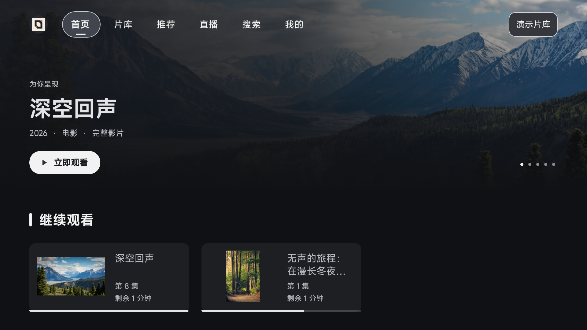 |
| 首页首卡 R2E | 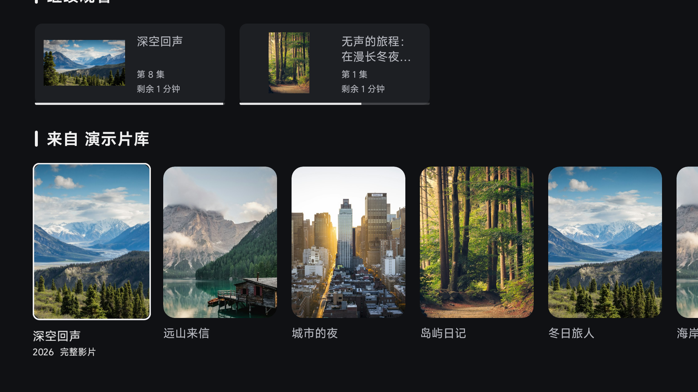 |
| 搜索首卡 R2E | 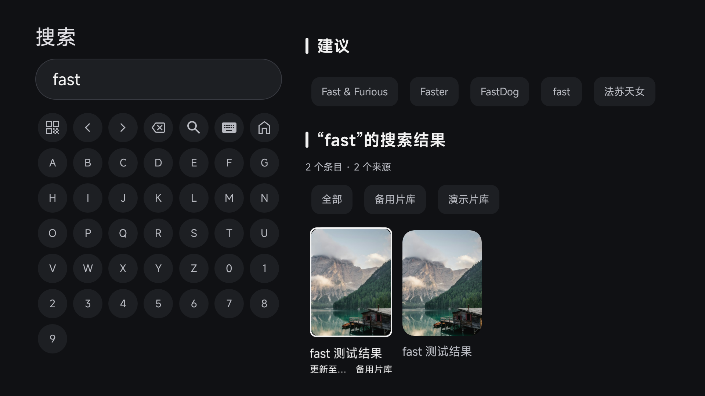 |
| 设置辅助操作 R2E | 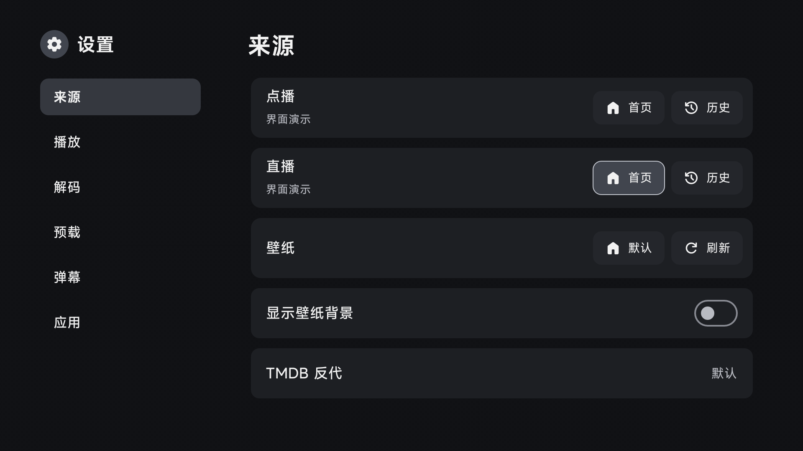 |
| 真实长标题与 360 集 R2F | 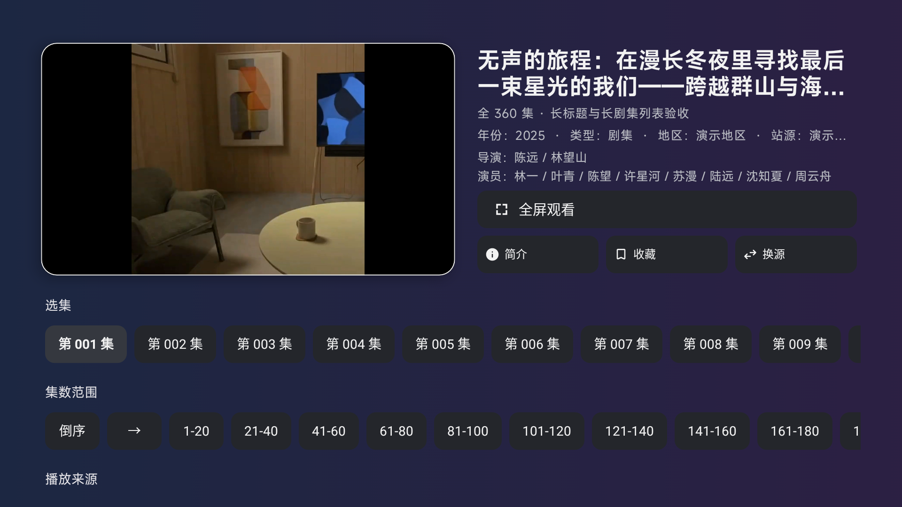 |
| 全屏返回观看按钮 R2G | 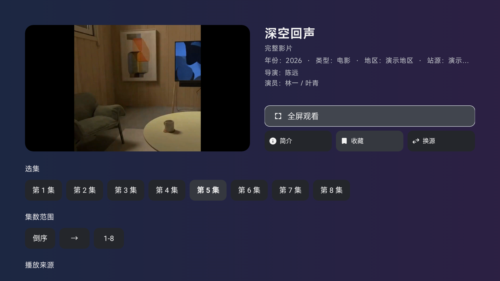 |
| 播放抽屉末项 R2F | 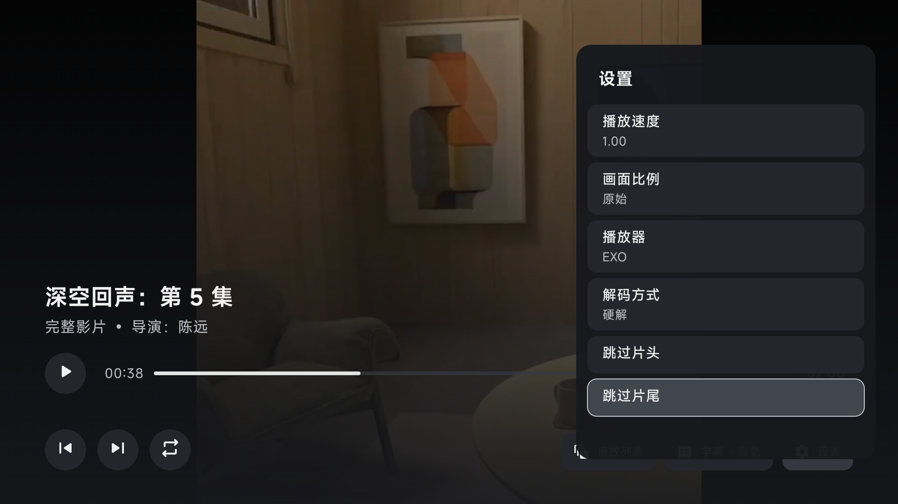 |
| 直播频道 R2H | 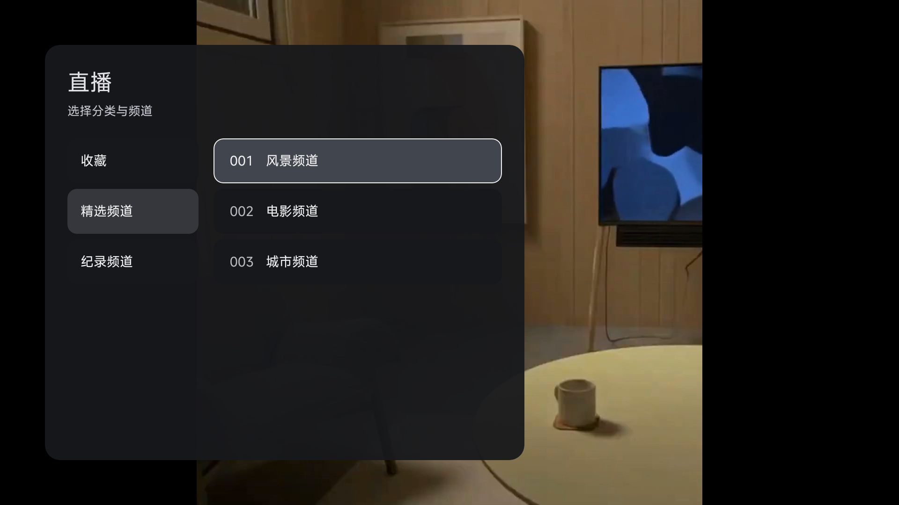 |

| 文件焦点修前 R2E | 修后 R2F |
| --- | --- |
| 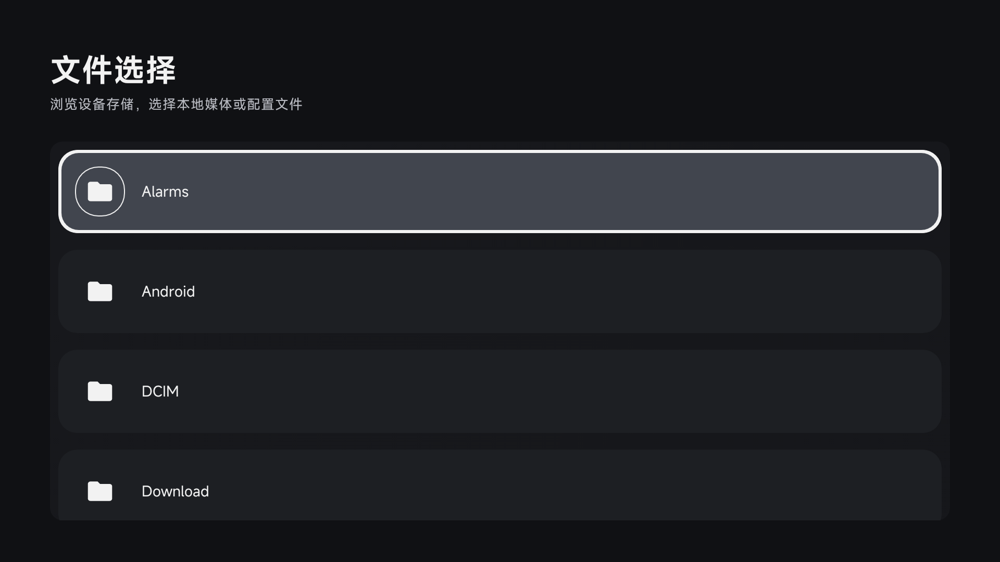 | 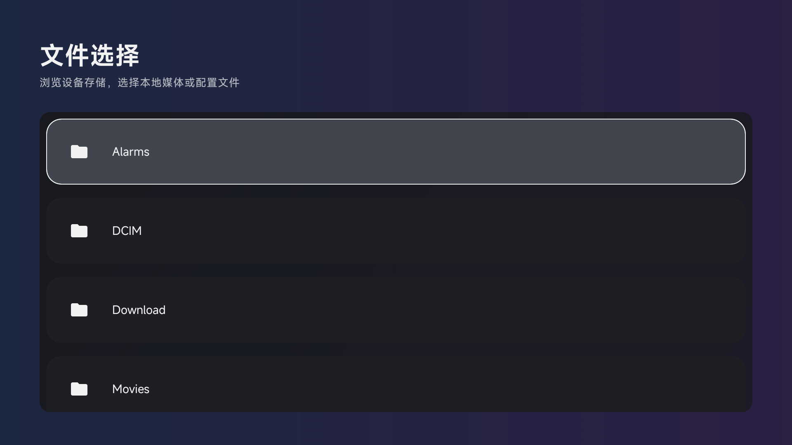 |

| 发现失败修前 R2G | 修后 R2H |
| --- | --- |
| 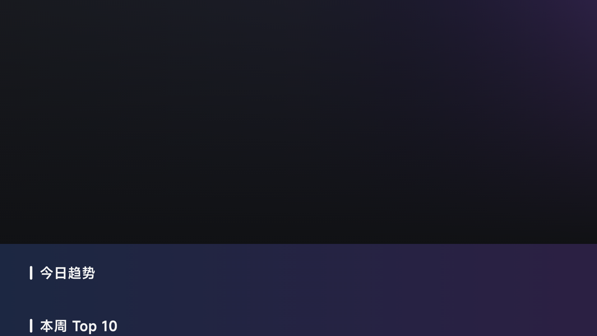 | 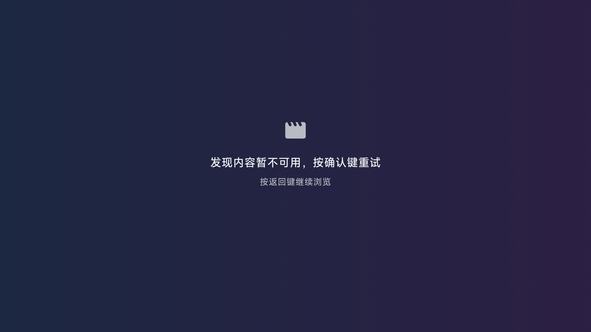 |

全部选图来源与哈希见 [index.json](evidence/index.json)。静态画面不证明动画性能。

## 尚未关闭的验收

- 当前构建没有 TMDB key，未注入真实密钥；因此发现页在线成功加载、失败→成功重试、详情/推荐完整内容路径未实测。设置代理不能绕过缺 key 前置检查。此限制不是网络成功验证。
- 多行长搜索/慢响应竞态、所有页面全部普通/选中/聚焦三态、每种弹窗确认/取消/权限分支、长抽屉值、直播收藏/真实 EPG 等全矩阵组合未完整覆盖。不能以单测或其他页面截图替代。
- 倒序专项在自然播放跳到下一集时断言不匹配，未形成有效通过证据；不把取证竞态直接认定为产品缺陷。
- API24 x86_64 软件模拟器使用合成片库及临时包装 APK（替换 x86 库、绕过未用 Python 初始化）；生产 ARM APK 实际运行、Python/MPV、硬解、真实投屏、当贝/坚果真机未测。API24 兼容目标保留，本轮没有重跑旧 API24 ART 专项。
- 本轮没有建立性能、无泄漏或生产服务重连完整验收；旧性能记录不能当本轮通过依据。

旧 `qa-results.md`、录像和 `verification.json` 仅保留历史功能证据，不能替代本轮视觉验收。剩余项保持开放，未建立“全部通过”完成标记。
